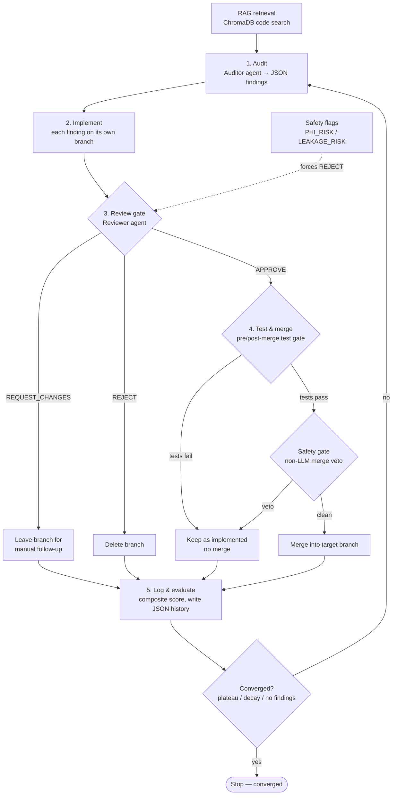

# AveryLoop

[](https://github.com/akarlin3/averyLoop/actions/workflows/test.yml)

An autonomous code audit → implement → review → merge pipeline powered by Claude. Uses specialized LLM agents (auditor, implementer, reviewer) with RAG-based codebase retrieval to continuously improve any code repository.

**Measured, not just clever.** AveryLoop *learns within a project* — it records
whether each past fix was accepted, vetoed, or reverted and recalls that history
when auditing similar code — and ships a benchmark that quantifies the result.
On the seeded-bug suite, convergence detection cuts iterations by **52%** with
fix rate held, and outcome memory **halves post-merge reverts** while keeping
false-accepts at **0%**. See [`benchmark/README.md`](benchmark/README.md) for the
full results table and methodology.

## Features

- **Four-agent pipeline**: audit, implement, review, merge — each with configurable system prompts
- **LLM-as-judge evaluation** with calibration examples and multi-dimensional scoring (specificity, accuracy, coverage, prioritization, domain appropriateness)
- **RAG context retrieval** via ChromaDB — semantic code search with language-aware chunking (Python, MATLAB)
- **Automatic diminishing returns detection** — stops the loop when merge rates drop, importance stalls, and the same files keep surfacing
- **Safety flags** for domain-specific risks (e.g. `LEAKAGE_RISK`, `PHI_RISK`) — configurable per project with critical flags that block automatic merge
- **Git branch isolation** per fix with post-merge test validation — each improvement gets its own branch, tests run before and after merge
- **Outcome-feedback RAG** — records every fix outcome (accepted / vetoed / reverted) in a persistent, rebuild-surviving ChromaDB store and recalls it as *additive* audit context ("2 prior fixes to similar code accepted, 1 reverted"), so the loop stops repeating known-bad changes
- **Benchmark harness** — runs AveryLoop against seeded-bug fixtures and reports fix rate, false-accept rate, convergence savings, and judge↔objective agreement, with convergence-on-vs-off and memory-on-vs-off comparisons
- **Full iteration logging** with score drift detection, finding deduplication, and structured JSON history

## How it works

Each iteration runs five phases. RAG retrieval feeds the audit; every finding is
implemented on its own branch and must clear a reviewer gate, a **deterministic
safety gate**, and a pre/post-merge test gate before it lands. After each
iteration an **authored convergence detector** decides whether the loop has
stopped improving — the loop is no longer a fixed iteration count.

The loop's hard decisions now have a code-level backbone, not just an LLM:

- **Convergence detection** (`convergence.py`) decides *when to stop* from the
  iteration history — plateau, decay, and a min-iteration floor — bounded by
  `max_iterations`.
- **Composite score** (`signals.py` + the evaluator blend) decides *whether a
  change is good* by blending the LLM judge with measured signals (tests,
  coverage, complexity, diff size, scope adherence). The judge is now one
  input, not the oracle.
- **Deterministic safety gate** (`safety_gate.py`) decides *whether a merge is
  safe* with non-LLM code checks that cannot be prompt-injected away.

See [`docs/EVALUATION.md`](docs/EVALUATION.md) for the exact formulas, signal
ranges, convergence criteria, and safety ruleset.



## Installation

From source (editable):

```bash
git clone https://github.com/akarlin3/averyLoop.git
cd averyloop
pip install -e ".[test]"
```

From PyPI (when published):

```bash
pip install averyloop
```

### Requirements

- Python >= 3.10
- An [Anthropic API key](https://console.anthropic.com/)
- Git (the loop creates branches and merges)

## Quick Start

```bash
# 1. Copy the example config
cp project_config.example.yaml project_config.yaml

# 2. Edit it with your repo's source directories, test command, and prompts
#    (see Configuration below)

# 3. Set your API key in project_config.yaml (anthropic_api_key field)

# 4. Run a single iteration to test
averyloop --single-iteration

# 5. Run the full loop (up to 10 iterations by default)
averyloop

# 6. Dry run (no API calls, no code changes — validates setup)
averyloop --dry-run
```

## Example run

The fastest way to confirm your setup works — without an API key — is `--dry-run`,
which exercises the full phase scaffolding while skipping every Anthropic call and
code change.

Captured from `averyloop --dry-run` (run in an empty git repo):

```text
============================================================
  Improvement Loop [project] — DRY RUN (max 10 iterations)
============================================================

────────────────────────────────────────────────────────────
  ITERATION 1/10
────────────────────────────────────────────────────────────

[1/5] Gathering context from prior iterations...
[2/5] Running code audit via Claude API...
       Audit response: 38 chars
       Found 0 valid finding(s)
Exit condition met — dry-run mode

============================================================
Iteration 1 — 2026-05-29T00:28:25.685298
============================================================
Audit score:       5.0/10
Findings:          0 total, 0 high priority
Branches created:  0
Branches merged:   0
Tests passed:      True
Exit condition:    YES — stopping
============================================================

  Loop complete after 1 iteration(s).

============================================================
  IMPROVEMENT LOOP SUMMARY [project] — 1 iteration(s)
============================================================
  Iter 1: 0 findings, 0 merged, score=5.0/10, tests=pass [EXIT]

  Findings:     0 total, 0 implemented, 0 pending

  Status: Converged — all findings below threshold
============================================================
```

Every iteration is appended to `averyloop_log.json` at the repo root. Each entry
follows this schema (here, the entry produced by the dry run above):

```json
{
  "iteration": 1,
  "timestamp": "2026-05-29T00:28:25.685298",
  "audit_scores": {
    "specificity": 5.0,
    "accuracy": 5.0,
    "coverage": 5.0,
    "prioritization": 5.0,
    "domain_appropriateness": 5.0,
    "overall": 5.0,
    "flags": [],
    "reasoning": "Dry-run mode — skipped API evaluation."
  },
  "findings": [],
  "findings_count": 0,
  "high_priority_findings": 0,
  "branches_created": [],
  "branches_merged": [],
  "tests_passed": true,
  "exit_condition_met": true
}
```

In a live run, `findings` holds one tagged object per audit finding (`id`,
`iteration`, `dimension`, `file`, `description`, `fix`, `importance`,
`branch_name`, `status`), and `branches_created` / `branches_merged` are derived
from those findings' branches.

## Configuration

The loop is configured through two files:

### `project_config.yaml` — Project-Specific Settings

Controls what gets audited, how tests run, and what prompts the agents use. The loader searches in order:

1. Explicit path passed to `load_project_config()`
2. `PROJECT_CONFIG` environment variable
3. `./project_config.yaml`
4. `./averyloop_project.yaml`

| Field | Type | Default | Description |
|---|---|---|---|
| `name` | string | `""` | Short project name, shown in logs and index metadata |
| `description` | string | `""` | One-liner for audit context |
| `languages` | list | `["python"]` | Languages present in the codebase |
| `default_branch` | string | `"main"` | Branch to merge improvements into |
| `branch_prefix` | string | `"improvement/"` | Prefix for improvement branches |
| `source_dirs` | list | `["src/"]` | Directories containing source code to audit |
| `test_command` | string | `"python -m pytest tests/ -q --tb=short"` | Shell command to run the test suite |
| `test_ignores` | list | `[]` | Pytest paths/patterns to skip |
| `read_only_dirs` | list | `[]` | Directories the loop may read but must never modify |
| `skip_dirs` | list | `[".git", "__pycache__"]` | Directories to skip when indexing/scanning |
| `key_files` | list | `[]` | Important files the auditor should always review |
| `anthropic_api_key` | string | `""` | API key (falls back to loop config) |
| `audit_model` | string | `""` | Model for audits (falls back to loop config default) |
| `fix_model` | string | `""` | Model for fixes (falls back to loop config default) |
| `judge_model` | string | `""` | Model for scoring (falls back to loop config default) |
| `collection_name` | string | `"codebase_index"` | ChromaDB collection name |
| `skip_extensions` | list | `[".png", ".jpg", ".pdf"]` | File extensions to skip when indexing |

#### Prompts (nested under `prompts:`)

| Field | Description |
|---|---|
| `audit_system` | System prompt for the auditor agent — defines what to look for and how to format findings |
| `review_system` | System prompt for the reviewer agent — defines how to evaluate proposed patches |
| `judge_system` | System prompt for the judge — defines scoring dimensions and output format |
| `judge_calibration` | Calibration examples for the judge — anchors scores to concrete examples |

#### Safety

| Field | Type | Default | Description |
|---|---|---|---|
| `risk_flags` | list | `["LEAKAGE_RISK", "PHI_RISK"]` | Flags the auditor/judge may raise |
| `critical_flags` | list | `["LEAKAGE_RISK", "PHI_RISK"]` | Flags that block automatic merge |
| `forbidden_patterns` | list | `[]` | Regex patterns that must never appear in patches |

See [`project_config.example.yaml`](project_config.example.yaml) for the full schema with inline comments.

### `averyloop_config.json` — Loop Tuning

Controls API models, token limits, exit strategy, and diminishing returns thresholds. All fields have sensible defaults — this file is optional.

| Field | Default | Description |
|---|---|---|
| `exit_strategy` | `"both"` | `"classic"`, `"diminishing_returns"`, or `"both"` |
| `importance_threshold` | `2` | Findings >= this keep the loop going |
| `min_coverage_score` | `6.0` | Coverage below this keeps the loop going |
| `dr_window` | `4` | Iterations to examine for diminishing returns |
| `convergence_enabled` | `true` | Break the loop early on convergence |
| `convergence_epsilon` | `0.25` | Min score gain that counts as progress |
| `convergence_patience` | `2` | Consecutive stalled iterations → plateau |
| `min_iterations` | `2` | Floor: never stop before this iteration |
| `weight_llm` | `0.5` | Composite weight of the LLM judge score |
| `weight_tests` | `0.2` | Composite weight of the test signal |
| `weight_coverage` | `0.1` | Composite weight of the coverage-delta signal |
| `weight_complexity` | `0.1` | Composite weight of the complexity-delta signal |
| `weight_scope` | `0.1` | Composite weight of the scope-adherence signal |
| `safety_gate_enabled` | `true` | Run the deterministic merge veto |
| `safety_protected_paths` | loop safety code | Paths a fix may not edit |
| `safety_denylist_paths` | `[]` | Extra read-only path prefixes |
| `safety_allowlist_paths` | `[]` | Paths exempt from the scope check |
| `audit_model` | `"claude-opus-4-6"` | Model for code audits |
| `fix_model` | `"claude-opus-4-6"` | Model for generating fixes |
| `judge_model` | `"claude-opus-4-6"` | Model for scoring audits |
| `audit_max_tokens` | `32000` | Max tokens for audit responses |
| `max_api_retries` | `3` | Retries on rate limit errors |

## Architecture

```
┌─────────────────────────────────────────────────────────┐
│                    Orchestrator (v2)                     │
│                                                         │
│  for each iteration:                                    │
│    1. Gather context from prior iterations               │
│    2. Run audit (Auditor Agent + RAG context)            │
│    3. Parse findings into typed Finding objects           │
│    4. For each finding:                                  │
│       a. Create branch                                   │
│       b. Generate fix (Implementer)                      │
│       c. Run tests (syntax check + test suite)           │
│       d. Safety gate (non-LLM veto) — then merge         │
│    5. Score: blend Judge + objective signals (composite) │
│    6. Log iteration; convergence detector checks for stop │
└─────────────────────────────────────────────────────────┘
```

### Agents

| Agent | Module | Role |
|---|---|---|
| **Auditor** | `agents/auditor.py` | Scans the codebase and returns structured JSON findings with file, line, severity, and suggested fix |
| **Implementer** | `agents/implementer.py` | Takes a finding and the original file, returns the complete updated file |
| **Reviewer** | `agents/reviewer.py` | Evaluates patches for correctness, test coverage, and convention adherence |
| **Judge** | `evaluator.py` | Scores the audit on 6 dimensions (0-10 each), returns flags; its score is then blended with objective signals into a composite |

### RAG Layer

| Module | Role |
|---|---|
| `rag/chunker.py` | Splits source files into semantic chunks (by class/function for Python, by `function` keyword for MATLAB) |
| `rag/indexer.py` | Builds and queries a ChromaDB vector index for semantic code search |

### Supporting Modules

| Module | Role |
|---|---|
| `project_config.py` | Loads project-specific YAML config with cached singleton |
| `loop_config.py` | Loads loop tuning JSON config with cached singleton |
| `loop_tracker.py` | Logs iterations, tracks findings, detects score drift |
| `git_utils.py` | Branch creation, checkout, merge, test runners, syntax checks |
| `convergence.py` | **Authored, non-LLM** stop detection (plateau / decay / floor) |
| `signals.py` | **Pure** objective sub-scores (tests, coverage, complexity, diff size, scope) |
| `safety_gate.py` | **Deterministic, non-LLM** merge veto |
| `outcomes.py` | **Pure** outcome derivation (accepted/rejected/reverted) + revert detection |
| `rag/outcome_memory.py` | Persistent outcome store + recall as additive audit context |

The last three are pure, unit-tested modules with no LLM calls or live git
state — the authored-logic core. See [`docs/EVALUATION.md`](docs/EVALUATION.md).

### Exit Conditions

The loop stops when one of these is met (bounded always by `max_iterations`):

1. **Convergence** (`convergence.py`, authored, non-LLM): after a
   `min_iterations` floor, the loop stops on **plateau** (composite/judge
   score improves by less than `convergence_epsilon` for
   `convergence_patience` consecutive iterations — a score *drop* counts as a
   stall too) or **decay** (no fixes accepted for `convergence_patience`
   iterations). The stop reason and signal values are logged.
2. **Classic**: No findings above the importance threshold AND audit coverage
   is sufficient AND no critical flags.
3. **Diminishing returns** (legacy detector): over the last N iterations, merge
   rate is low, average importance is low, the same files keep appearing, and
   audit scores aren't improving.
4. **Max iterations reached** — the hard ceiling.

### Composite score (LLM is one signal among measured ones)

The credibility story: the LLM judge no longer decides quality alone. Each
iteration's score is a weighted blend of the judge's `overall` and measured
objective sub-scores, with **defaults** `weight_llm=0.5`, `weight_tests=0.2`,
`weight_coverage=0.1`, `weight_complexity=0.1`, `weight_scope=0.1`. Signals
whose tooling is absent (e.g. no `coverage`/`radon` installed) **drop out and
the remaining weights renormalize** — never crashing. The raw LLM score and
every objective signal are kept in `averyloop_log.json` so each blend is
auditable.

### Deterministic safety gate

Before any merge, `safety_gate.py` runs code-level (non-LLM) checks and vetoes
the merge — regardless of the judge's verdict — on: out-of-scope / read-only
writes, removal of test assertions, credential-like patterns, and edits to the
loop's own safety code. It is defense-in-depth: it runs *in addition to* the
judge-emitted critical flags and cannot be prompt-injected away.

### Outcome-feedback memory (the loop learns within a project)

AveryLoop is no longer memoryless across runs. After each iteration,
`outcomes.py` derives a typed outcome for every implemented finding —
**accepted** (merged and not reverted), **rejected** (safety-gate veto, reviewer
rejection, or a test failure), or **reverted** (merged then undone, incl.
post-merge auto-reverts and human `git revert`s detected from history) — and
`rag/outcome_memory.py` embeds it into a **dedicated, persistent ChromaDB
collection** (`outcome_memory`).

That collection is keyed separately from `codebase_index`, so it **survives the
index rebuild** that happens every run and accumulates over time. When the next
audit runs, the loop recalls outcomes for *similar code* and injects a short
advisory note as **additive context only** — e.g. *"previous fixes to similar
code: 2 accepted, 1 reverted — the revert removed a guard clause"* — never a
control-flow change, so it cannot destabilize the loop. It is gated by
`outcome_memory_enabled` (default on) and can be turned off for clean baselines.
Embedding is deterministic and offline (a hashed bag-of-words vectorizer), so it
adds no API/network dependency. See [`benchmark/README.md`](benchmark/README.md)
for the measured effect (reverts halved, wasted re-attempts eliminated).

## Adapting to Your Project

To use AveryLoop on a new codebase:

### 1. Define your source layout

```yaml
source_dirs: ["src/", "lib/"]
test_command: "python -m pytest tests/ -v --timeout=60"
read_only_dirs: ["vendor/", "third_party/"]
skip_dirs: [".git", "__pycache__", "node_modules"]
key_files: ["src/core/engine.py", "src/api/routes.py"]
```

### 2. Write domain-specific prompts

The most important step. Good prompts tell the auditor what matters in your domain:

```yaml
prompts:
  audit_system: |
    You are a senior code auditor for a [YOUR DOMAIN] project.
    Focus on:
    - [Domain-specific concern 1]
    - [Domain-specific concern 2]
    - Code quality and test coverage

    When you find an issue, return a JSON object with:
    file, line_start, line_end, severity, category, description,
    suggested_fix, and any risk flags.

  judge_calibration: |
    Scoring calibration for [YOUR PROJECT]:
    - 9-10: [What constitutes a critical fix in your domain]
    - 7-8:  [Significant improvements]
    - 5-6:  [Minor improvements]
    - 1-4:  [Low-value changes]
```

### 3. Configure safety flags

```yaml
risk_flags: ["SECURITY_RISK", "DATA_LOSS_RISK"]
critical_flags: ["SECURITY_RISK"]  # These block auto-merge
forbidden_patterns:
  - "password"
  - "api_key"
  - '\beval\s*\('
```

## Troubleshooting

### "No module named 'anthropic'"

Install dependencies: `pip install -e ".[test]"`

### Loop exits immediately

Check `averyloop_log.json` for the exit reason. Common causes:
- All findings below `importance_threshold` (default: 2)
- Audit coverage score above `min_coverage_score` (default: 6.0)
- No findings returned by the auditor (check your `source_dirs` and `key_files`)

### Rate limit errors

The loop retries automatically with exponential backoff. If persistent:
- Increase `retry_base_delay` in `averyloop_config.json`
- Reduce `audit_max_tokens` to lower per-request cost
- Use a smaller model for fixes: set `fix_model` to `"claude-sonnet-4-6"`

### Tests fail after merge

The loop runs tests both pre-merge and post-merge. If post-merge tests fail, the finding is logged as `"implemented"` (not `"merged"`). Check the log for details and manually resolve conflicts.

### Diminishing returns triggers too early

Increase the thresholds in `averyloop_config.json`:
```json
{
  "dr_window": 6,
  "dr_max_merge_rate": 0.25,
  "dr_max_avg_importance": 5.0
}
```

### Finding the log

Iteration history is in `averyloop_log.json` at the repo root. View a summary:
```bash
python -m averyloop.loop_tracker summary
```

## Development

```bash
# Install with test dependencies
pip install -e ".[test]"

# Run the test suite
python -m pytest tests/ -q

# Run a specific test file
python -m pytest tests/test_evaluator_finding.py -v
```

### Project Structure

```
averyloop/
├── __init__.py
├── project_config.py      # Project-specific YAML config loader
├── loop_config.py          # Loop tuning JSON config loader
├── evaluator.py            # Judge scoring + composite blend + exit logic + Finding model
├── convergence.py          # Authored, non-LLM stop detection (plateau/decay/floor)
├── signals.py              # Pure objective sub-scores (tests/coverage/complexity/scope)
├── safety_gate.py          # Deterministic, non-LLM merge veto
├── outcomes.py             # Pure outcome derivation (accept/reject/revert) + revert detection
├── git_utils.py            # Git operations + test runners
├── loop_tracker.py         # Iteration logging + context generation
├── orchestrator_v2.py      # Main loop: audit → fix → test → safety gate → merge
├── agents/
│   ├── _api.py             # Shared API client + retry logic
│   ├── auditor.py          # Audit prompt + source file collection
│   ├── implementer.py      # Fix generation from findings
│   └── reviewer.py         # Review prompt for patch evaluation
└── rag/
    ├── chunker.py           # Language-aware code chunking
    ├── indexer.py           # ChromaDB index build + query
    ├── retriever.py         # Semantic code retrieval
    └── outcome_memory.py    # Persistent accept/reject/revert memory + recall

benchmark/                  # Offline, measured evaluation (see benchmark/README.md)
├── fixtures/                # Seeded-bug mini-repos with encoded ground truth
├── stub_agents.py           # Deterministic agents; real decisions via authored logic
├── metrics.py               # Fix rate, false-accept, convergence savings, agreement
└── runner.py                # Two-arm comparison + results table + JSON
```

## Contributing

1. Fork the repository
2. Create a feature branch (`git checkout -b feature/my-change`)
3. Make your changes and add tests
4. Run the test suite (`python -m pytest tests/ -q`)
5. Commit and push
6. Open a pull request

## License

GNU AGPL v3 — see [LICENSE](LICENSE).
